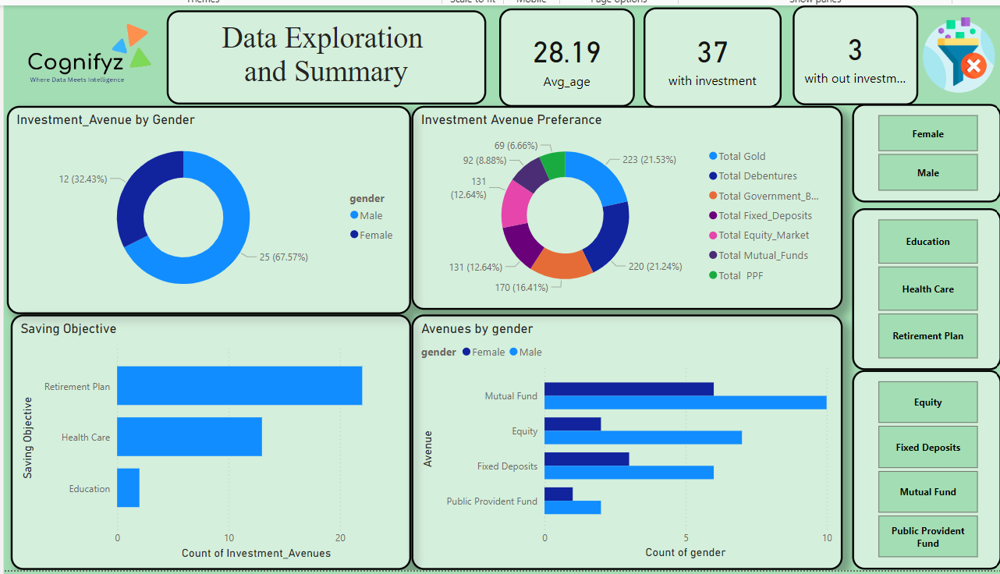
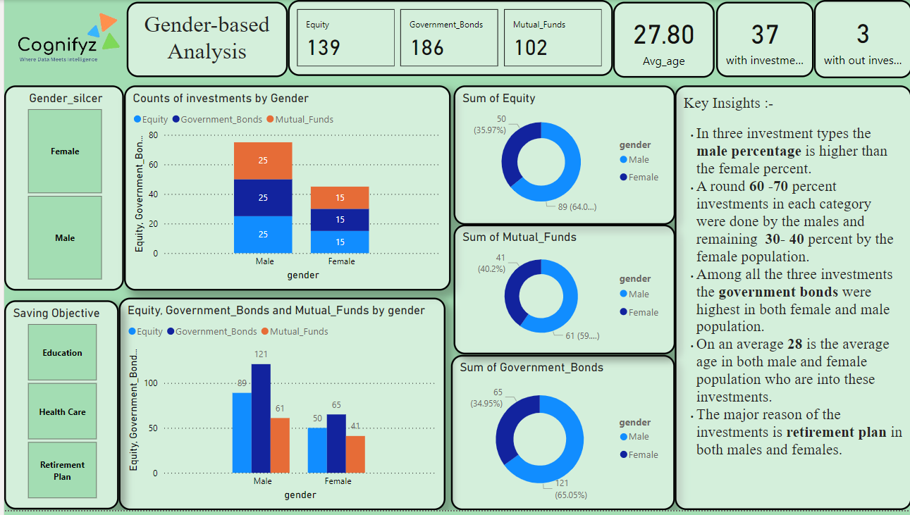
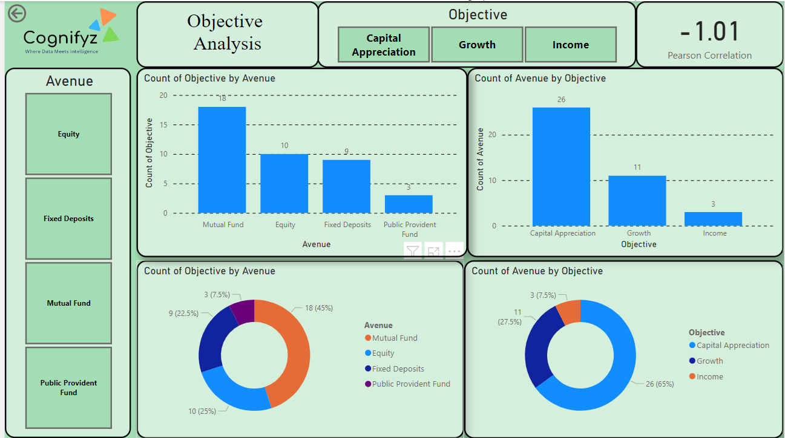
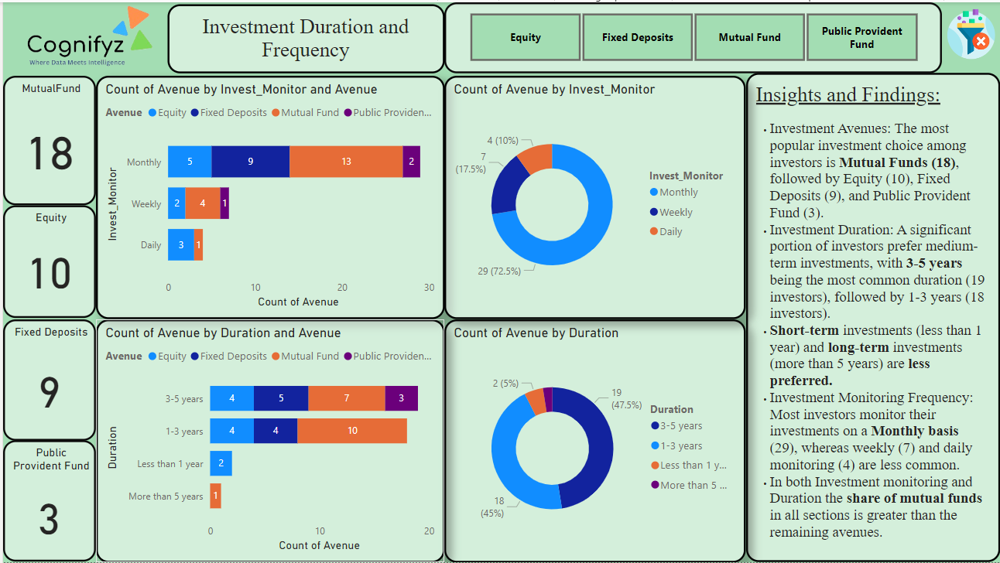
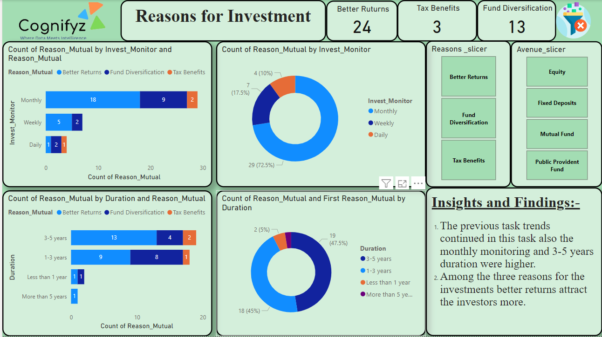
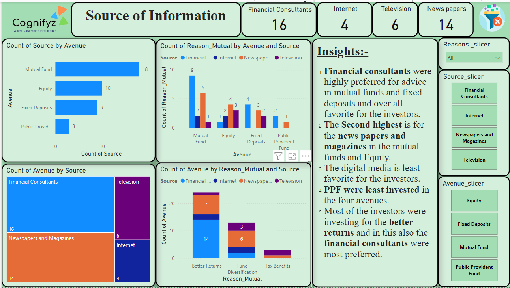
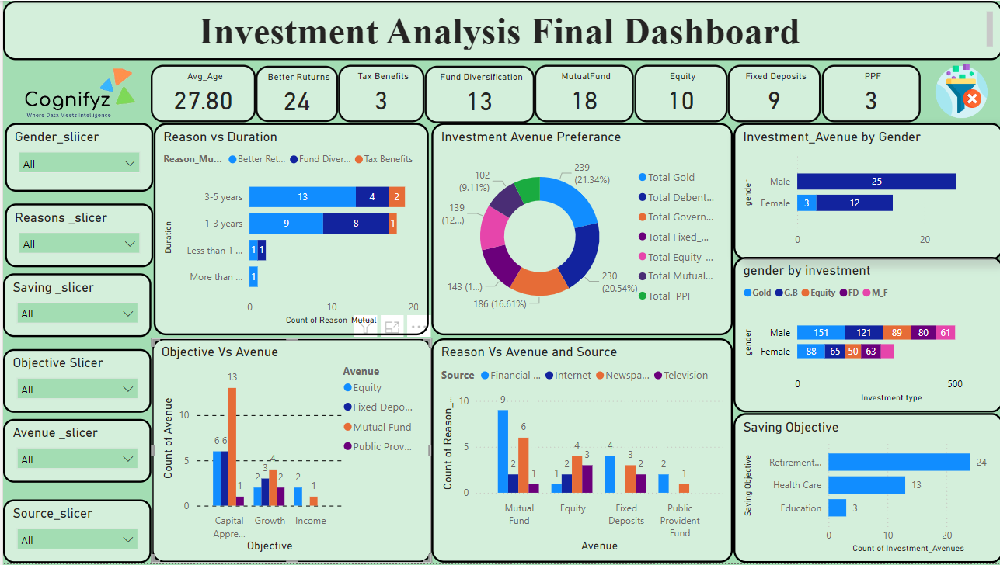

# Cognifyz_PowerBi_Internship
## Task 1 : Data Exploration and Summary
### Objective: Understand and summarize key statistics in the dataset.
### Steps
1. The data set was loaded into the Powerbi using the get data option from Excel work book.
2. Then the data types of the each column were examined and correcteds if necessary.
3. Dax Functions were  used to calculate the avg_age, gold, FD, equatiy e.t.c using the Avg, Countrows like functions.
4. Finally the dash board was created as below.

## Task 2 : Gender-based Analysis
### Objective: Analyze and visualize gender-based differences in investment preferences.

#### Key Insights :-
1. In three investment types the male percentage is higher than the female percent.
2. A round 60 -70 percent investments in each category were done by the males and remaining  30- 40 percent by the female population.
3. Among all the three investments the government bonds were  highest in both female and male population.
4. On an average 28 is the average age in both male and female population who are into these investments.
5. The major reason of the investments is retirement plan in both males and females.

## Task : Objective Analysis
### Objective: Analyze the relationship between savings objectives and investment choices.

1. Pearson correlation was calculated
2. The relationship between the investment choice and saving objective was visualized

## Task 4 : Investment Duration and Frequency
### Objective: Analyze investment durations and monitoring frequencies.

#### Key Insights:
1. Investment Avenues: The most popular investment choice among investors is Mutual Funds (18), followed by Equity (10), Fixed Deposits (9), and Public Provident Fund (3).
2. Investment Duration: A significant portion of investors prefer medium-term investments, with 3-5 years being the most common duration (19 investors), followed by 1-3 years (18 investors). 
3. Short-term investments (less than 1 year) and long-term investments (more than 5 years) are less preferred.
4. Investment Monitoring Frequency: Most investors monitor their investments on a Monthly basis (29), whereas weekly (7) and daily monitoring (4) are less common.
5. In both Investment monitoring and Duration the share of mutual funds in all sections is greater than the remaining avenues.

## Task 5: Reasons for Investment
### Objective: Analyze and visualize the reasons for investment.

#### Key Insights:-
1. The previous task trends continued in this task also the monthly monitoring and 3-5 years duration were higher.
2. Among the three reasons for the investments better returns attract the investors more.

## Task 6: Source of Information
### Objective: Analyze the sources from which individuals gather investment information.

Key Insights:-
1. Financial consultants were highly preferred for advice in mutual funds and fixed deposits and over all favorite for the investors.
2. The Second highest is for the news papers and magazines in the mutual funds and Equity.
3. The digital media is least favorite for the investors.
4. PPF were least invested in the four avenues.
5. Most of the investors were investing for the better returns and in this also the financial consultants were most preferred.

## Task 7: Combine Insights into a Dashboard
### Objective: Create a comprehensive dashboard incorporating all insights.
. Finally all the task visuals were taken and the best were chosen to represent the data in meaningful way and final dashboard was created.

## Conclusion
1. A mong all the investment types the gold was preferred more than the others.
2. The male population were more aggressive ini investments and female were balanced.
3. In Avenue types the mutual funds were preferred more than the others.
4. The main reason for the investment was the retirement planning.
5. Financial consultants were highly preferred for advice for the investments.
6. Finally people were interested in investmnents because as a passive income the high returns can be expected form the invesments then the other sources.

