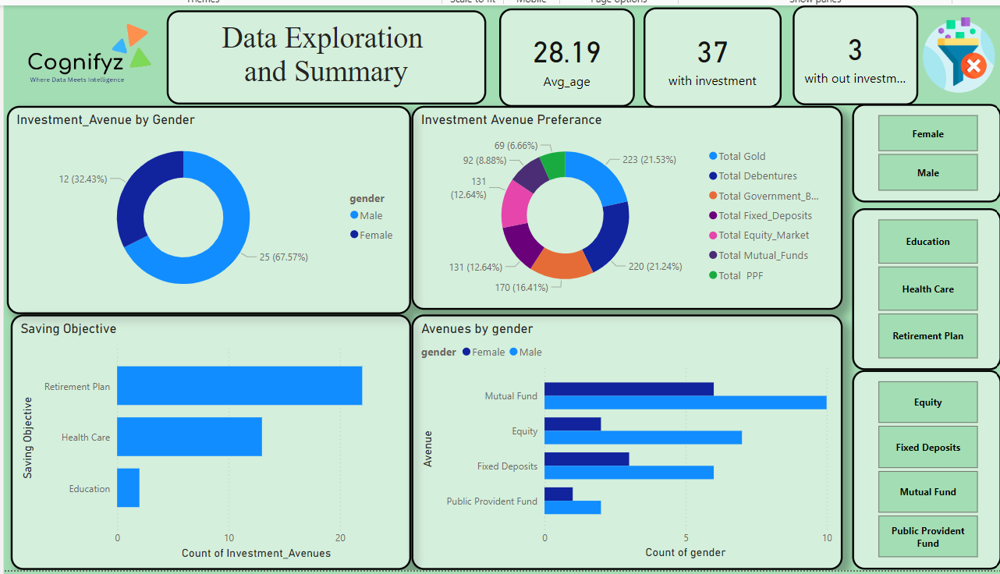

# Cognifyz_PowerBi_Internship
## Task 1 : Data Exploration and Summary
Objective: Understand and summarize key statistics in the dataset.
### Steps
1. The data set was loaded into the Powerbi using the get data option from Excel work book.
2. Then the data types of the each column were examined and correcteds if necessary.
3. Dax Functions were  used to calculate the avg_age, gold, FD, equatiy e.t.c using the Avg, Countrows like functions.
4. Finally the dash board was created as below.

